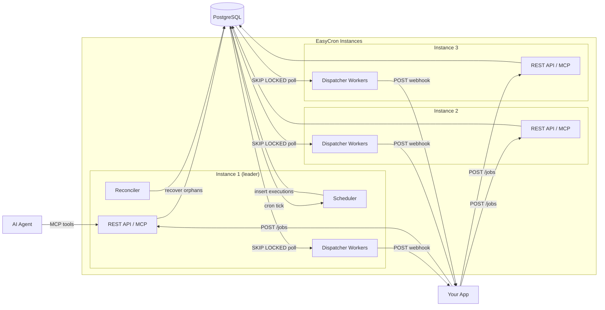

# EasyCron

**Schedule HTTP webhooks with cron expressions. No SDK, no queue, no complexity.**

[](https://go.dev)
[](LICENSE)
[](https://deepwiki.com/djlord-it/easy-cron)

EasyCron is a self-hosted cron-as-a-service with namespace-scoped API keys and MCP support. POST a job with a cron expression and a webhook URL — EasyCron fires HTTP callbacks on schedule with HMAC-signed payloads, automatic retries, and Prometheus metrics.

## Architecture



1. Register jobs via the REST API (any instance)
2. Instances compete for a Postgres advisory lock — exactly one becomes **leader**
3. The leader's **Scheduler** inserts executions into Postgres on each tick
4. **Dispatcher workers** on all instances poll Postgres with `SKIP LOCKED` to claim and deliver webhooks
5. The leader's **Reconciler** recovers stalled executions
6. If the leader dies, a follower takes over within seconds

> **Single-instance mode:** Set `DISPATCH_MODE=channel` (default) for an in-memory Event Bus instead of DB polling. Simpler, but no horizontal scaling.

## Quick Start

```bash
docker compose up -d
```

Bootstrap an API key:

```bash
docker compose exec easycron easycron create-key default local-dev
```

Copy the printed token and export it:

```bash
export EASYCRON_API_KEY="ec_..."
```

Create a job:

```bash
curl -X POST http://localhost:8080/jobs \
  -H "Authorization: Bearer ${EASYCRON_API_KEY}" \
  -H "Content-Type: application/json" \
  -d '{
    "name": "test-job",
    "cron_expression": "* * * * *",
    "timezone": "UTC",
    "webhook_url": "https://httpbin.org/post",
    "webhook_secret": "my-secret"
  }'
```

Check executions:

```bash
curl -H "Authorization: Bearer ${EASYCRON_API_KEY}" \
  http://localhost:8080/jobs/{job_id}/executions
```

<details>
<summary>Manual setup (without Docker)</summary>

```bash
go build -o easycron ./cmd/easycron
createdb easycron
psql easycron < schema/001_initial.sql
psql easycron < schema/002_add_indexes.sql
psql easycron < schema/003_add_claimed_at.sql
psql easycron < schema/004_agent_platform.sql
export DATABASE_URL="postgres://localhost/easycron?sslmode=disable"
./easycron create-key default local-dev
./easycron serve
```
</details>

## Production Checklist

- [ ] All migrations applied: `001_initial.sql`, `002_add_indexes.sql`, `003_add_claimed_at.sql`, `004_agent_platform.sql`
- [ ] `RECONCILE_ENABLED=true` — without this, orphaned executions are **permanently lost**
- [ ] `METRICS_ENABLED=true`
- [ ] `DISPATCH_MODE=db` if running multiple instances
- [ ] At least one API key provisioned (`easycron create-key <namespace> <label>`)
- [ ] Webhook handlers are idempotent (use `X-EasyCron-Execution-ID`)
- [ ] Alert on `easycron_orphaned_executions > 0`

> Full details: [Operator Guide](OPERATORS.md)

## Configuration

All configuration is via environment variables. Run `./easycron --help` for the full list.

| Variable | Default | Description |
|----------|---------|-------------|
| `DATABASE_URL` | *required* | PostgreSQL connection string |
| `API_KEY` | *(optional)* | Legacy static Bearer token fallback (recommended for bootstrap/ops) |
| `HTTP_ADDR` | `:8080` | Listen address |
| `TICK_INTERVAL` | `30s` | Scheduler polling interval |
| `DISPATCH_MODE` | `channel` | `channel` (in-memory) or `db` (Postgres polling) |
| `DISPATCHER_WORKERS` | `1` | Concurrent dispatch workers (DB mode) |
| `RECONCILE_ENABLED` | `false` | Enable orphan recovery (**set `true` in production**) |
| `METRICS_ENABLED` | `false` | Enable Prometheus `/metrics` endpoint |
| `CIRCUIT_BREAKER_THRESHOLD` | `5` | Consecutive failures before circuit opens (0 = disabled) |
| `RATE_LIMIT` | `10` | Per-IP request rate limit (requests/sec) |

> **DO NOT run multiple instances with `DISPATCH_MODE=channel`.** Channel mode uses an in-memory event bus with no cross-instance coordination. Multiple instances will each run their own scheduler, producing duplicate webhook deliveries. Use `DISPATCH_MODE=db` for any multi-instance deployment.

## API

All API routes except `/health` require `Authorization: Bearer <token>`. Each API key is scoped to a **namespace** — operations only see and modify resources within the caller's namespace.

The full OpenAPI 3.0 spec is at [`api/openapi.yaml`](api/openapi.yaml) and can be used for client SDK generation via `oapi-codegen` or other tools.

| Method | Path | Description |
|--------|------|-------------|
| `GET` | `/health` | Health check (`?verbose=true` for components) |
| `POST` | `/jobs` | Create a job |
| `GET` | `/jobs` | List jobs (`?limit=&offset=&enabled=&name=&tag=key:value`) |
| `GET` | `/jobs/{id}` | Get job details + recent executions |
| `PATCH` | `/jobs/{id}` | Update job fields |
| `DELETE` | `/jobs/{id}` | Delete a job |
| `POST` | `/jobs/{id}/pause` | Pause a job |
| `POST` | `/jobs/{id}/resume` | Resume a job |
| `POST` | `/jobs/{id}/trigger` | Trigger immediate execution |
| `GET` | `/jobs/{id}/next-run` | Get next run + upcoming run times |
| `GET` | `/jobs/{id}/executions` | List executions (`status`, `trigger_type`, `since`, `until`) |
| `GET` | `/executions/{id}` | Get execution detail |
| `GET` | `/executions/pending-ack` | List unacknowledged completed executions |
| `POST` | `/executions/{id}/ack` | Acknowledge execution |
| `POST` | `/schedules/resolve` | Resolve natural-language schedule to cron |
| `POST` | `/api-keys` | Create API key (token returned once) |
| `GET` | `/api-keys` | List API keys |
| `DELETE` | `/api-keys/{id}` | Revoke API key |

### Webhook Delivery

Each fired job sends a POST with HMAC-signed payload:

```
X-EasyCron-Event-ID: <attempt-uuid>
X-EasyCron-Execution-ID: <execution-uuid>
X-EasyCron-Signature: <hmac-sha256-hex>
```

**Retries:** 4 attempts with backoff (immediate → 30s → 2m → 10m). Retryable: 5xx, 429, network errors. Non-retryable: 4xx.

**Circuit breaker:** After 5 consecutive failures per URL, delivery is short-circuited until cooldown expires.

Use `X-EasyCron-Execution-ID` for idempotency in your handler.

<details>
<summary>Signature verification (Go)</summary>

```go
func verifySignature(secret string, body []byte, signature string) bool {
    mac := hmac.New(sha256.New, []byte(secret))
    mac.Write(body)
    expected := hex.EncodeToString(mac.Sum(nil))
    return hmac.Equal([]byte(expected), []byte(signature))
}
```
</details>

## Horizontal Scaling

Run multiple instances against the same Postgres for HA. Requires `DISPATCH_MODE=db`.

- **Leader election** via Postgres advisory lock — one instance runs scheduler + reconciler
- **All instances** dispatch webhooks and serve the API
- **Automatic failover** within seconds if the leader dies

```bash
# Key env vars (same on all instances):
DISPATCH_MODE=db
LEADER_LOCK_KEY=728379
RECONCILE_ENABLED=true
METRICS_ENABLED=true
```

Validate with the HA test harness: `./scripts/ha_test.sh`

> See the [Operator Guide](OPERATORS.md#horizontal-scaling-multi-instance-ha) for tuning, failover timing, and alerting rules.

## CLI

| Command | Description |
|---------|-------------|
| `easycron serve` | Start server |
| `easycron validate` | Validate config (exit 0/2) |
| `easycron config` | Print effective config (secrets masked) |
| `easycron version` | Print version |
| `easycron create-key <namespace> <label>` | Create namespace API key and print plaintext token once |

## MCP (Model Context Protocol)

EasyCron exposes an MCP interface so AI agents can manage cron jobs programmatically. Two deployment options:

### Embedded Server (Streamable HTTP)

Every EasyCron instance serves MCP at `/mcp`. No extra binary needed — just point your MCP client at the running server.

### Standalone Stdio Proxy

For MCP clients that require stdio transport (e.g., Claude Desktop):

```bash
EASYCRON_URL=http://localhost:8080 \
EASYCRON_API_KEY=$EASYCRON_API_KEY \
go run ./cmd/easycron-mcp
```

<details>
<summary>Claude Desktop configuration</summary>

```json
{
  "mcpServers": {
    "easycron": {
      "command": "/path/to/easycron-mcp",
      "env": {
        "EASYCRON_URL": "http://localhost:8080",
        "EASYCRON_API_KEY": "ec_..."
      }
    }
  }
}
```
</details>

### Available Tools

| Tool | Description |
|------|-------------|
| `create-job` | Create a job (name, cron, timezone, webhook URL, optional tags/secret) |
| `list-jobs` | List jobs (filter by name, enabled status) |
| `get-job` | Get job details with schedule and recent executions |
| `update-job` | Update job fields |
| `delete-job` | Delete a job |
| `pause-job` | Pause scheduled execution |
| `resume-job` | Resume a paused job |
| `trigger-job` | Trigger immediate manual execution |
| `next-run` | Get next scheduled run times |
| `resolve-schedule` | Convert natural language (e.g., "every weekday at 9am") to cron |

All tools are namespace-scoped via the API key used for authentication.

## Security

- **Namespace isolation**: API keys are scoped to namespaces — each key can only access its own jobs and executions
- **SSRF protection**: Webhook URLs targeting private/reserved IP ranges (RFC 1918, loopback, link-local) are rejected at creation time
- **Rate limiting**: Per-IP token bucket rate limiter (default 10 req/sec) on all endpoints except `/health`
- **Credential safety**: `DATABASE_URL` and `REDIS_ADDR` credentials are masked in `easycron config` output; startup warns when `sslmode=disable`
- **Error sanitization**: Database error details are never exposed in API responses

## License

[Apache 2.0](LICENSE)
